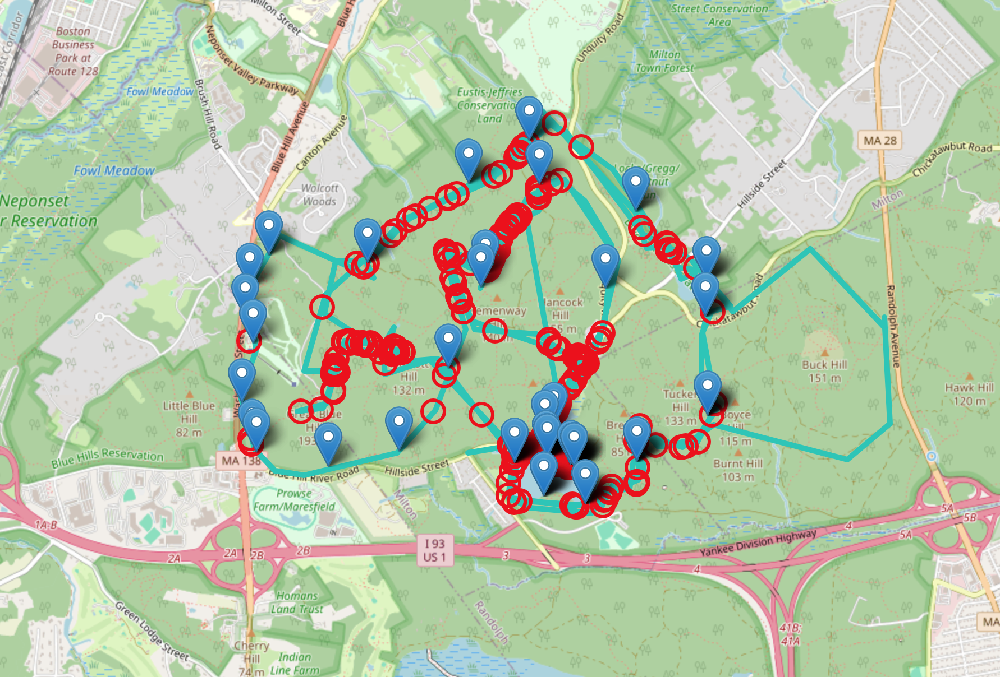

# safe-cycle 🚴

A GIS pipeline for validating GPS track data — built around transportation route integrity checks and spatial QA/QC.

## Stack

- Python
- Shapely
- GeoPandas
- GPXpy
- Folium
- Pytest

## Roadmap

- Speed plausibility validation
- Pytest test suite
- GeoJSON export
